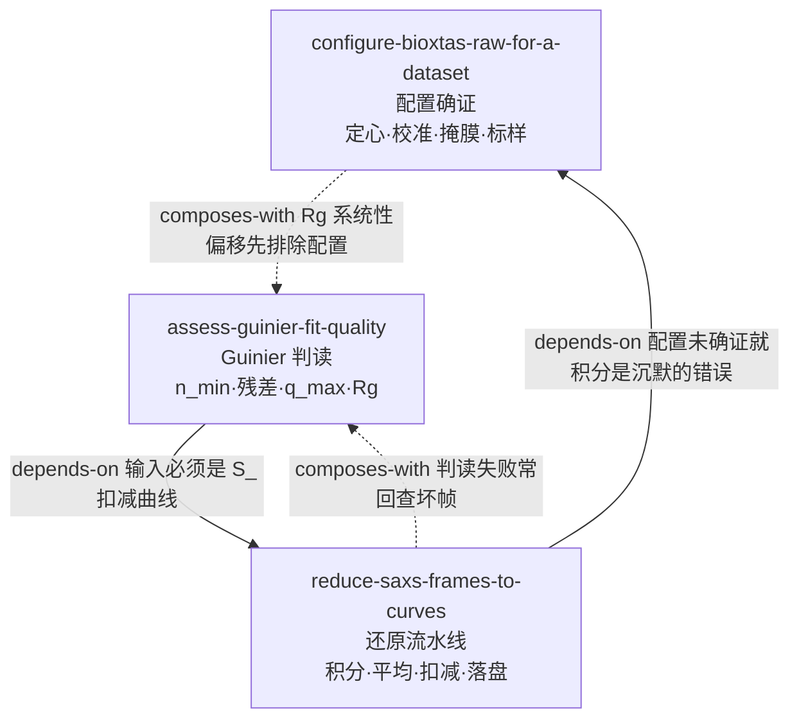

# INDEX —《BioXTAS RAW程序使用说明》→ AgentSkill-UsingBioXTASRAW

- **源**: 微信公众号「生物小角」· 刘广峰《BioXTAS RAW程序使用说明》（2024-04-26）
  https://mp.weixin.qq.com/s/Ul201MtOPO5DpVkpIomwZg
- **一句话主旨**: SAXS 数据的还原不是一个按钮，而是一条「配置 → 积分 → 平均 → 扣减 → 保存」的流水线；RAW 只是执行器，几何与掩膜全靠当天的配置文件带进来。
- **体裁**: 软件操作手册（官方文档翻译 + 上海光源 BL19U2 本地化增补），正文约 5.9k 字 + 13 张界面截图
- **流水线**: cangjie-skill（book2skill）RIA-TV++
- **审计轨迹**: `books/bioxtas-raw-manual/`（BOOK_OVERVIEW / candidates 34 条 / verified / rejected）
- **产出**: 3 个 skill（7 个合并单元 → 三重验证通过 3 个，通过率 43%）

---

## skill 总览

### A. 动手之前 —— 先把手上的数据"接对"

| skill | 用途 | 关键触发 |
|---|---|---|
| [configure-bioxtas-raw-for-a-dataset](../skills/configure-bioxtas-raw-for-a-dataset/SKILL.md) | 确证会话已加载当天的 `.cfg`（定心 / 样品-探测器距离 / 掩膜 / 标样），把"q 轴对不对"变成可检验事实 | q 轴与文献差一个数量级、Rg 差 10 倍、换了一天的数据、怀疑掩膜没生效、刚装好软件不知道要先加载什么 |

### B. 还原流水线 —— 把一批帧变成一条曲线

| skill | 用途 | 关键触发 |
|---|---|---|
| [reduce-saxs-frames-to-curves](../skills/reduce-saxs-frames-to-curves/SKILL.md) | 积分 → 平均 → 扣减 → 落盘四段流程，含 `A_`/`S_`/颜色/`*` 四个自检信号 | 「这 20 张 tif 怎么变成一条曲线」「`*` 和 `S_` 是什么意思」「能不能删了」「给 ATSAS 交什么格式」 |

### C. 判读 —— 这个数字信不信得过

| skill | 用途 | 关键触发 |
|---|---|---|
| [assess-guinier-fit-quality](../skills/assess-guinier-fit-quality/SKILL.md) | Guinier 拟合的取点（n_min/n_max）与判读（残差点、q_max·Rg ≈ 1.3、Rg 单位 = 1/q），报告必须带区间 | 「n_min=11 要不要改」「Rg 差了 10 倍」「q_max·Rg 到 1.6 了还能用吗」「报 Rg 要交代什么」 |

**共享参考资料**

| 文件 | 内容 | 被谁引用 |
|---|---|---|
| [`configure-…/references/bioxtas-raw-glossary.md`](../skills/configure-bioxtas-raw-for-a-dataset/references/bioxtas-raw-glossary.md) | 12 条术语的「作者用法 vs 常识」+ 硬数字表 + 高级分析外链 | 三条 skill |
| [`reduce-…/references/raw-workspace-and-naming.md`](../skills/reduce-saxs-frames-to-curves/references/raw-workspace-and-naming.md) | 三面板 / 四绘制选项卡 / 菜单 / 文件选项卡 / 前缀与颜色状态机 | `reduce-…`、`assess-…` |

---

## 引用图

关系共 4 条（1 组依赖 ×2、1 组组合 ×2），落在方法论建议的稀疏区间内：**没有硬造关系**——三条 skill 之间确实是一条单向数据链（配置 → 曲线 → Rg），外加两条回查边。

## 推荐顺序

1. **`configure-bioxtas-raw-for-a-dataset`** —— 数据一到手就该问的问题：我凭什么相信现在的 q 轴。
2. **`reduce-saxs-frames-to-curves`** —— 配置确证之后才有意义的流水线；第 1 步会判停回第 1 条。
3. **`assess-guinier-fit-quality`** —— 有了 `S_` 曲线才谈判读；结果异常时反向回查前两条。

三条 skill 的先后天然由数据形态决定（会话几何 → 2D 帧 → 1D 曲线 → 拟合值），不需要额外的心智模型铺垫。

---

## 边界（本次蒸馏明确不覆盖的事）

- **SEC-SAXS 处理**：数据在 Series 选项卡里看，原文只有一个选项卡说明，没有流程（淘汰组见 `rejected/README.md`）。
- **分子量测定**：原文只列六条路线名（标样 I0 比对 / 绝对校准 / Vc / Vp / Shape&Size / Bayesian），无步骤无判据 → 不成 skill。
- **IFT/GNOM、形状重建、3D 重建、与 PDB 对齐**：原文只到外链（https://bioxtas-raw.readthedocs.io/ ）。
- **RAW 的安装**：一次性操作，随版本变 → 写成事实放在 `configure-…` 的 B 段。
- **从零标定一台陌生仪器**：原文把这件事交给线站工作人员，本仓库不越界。
