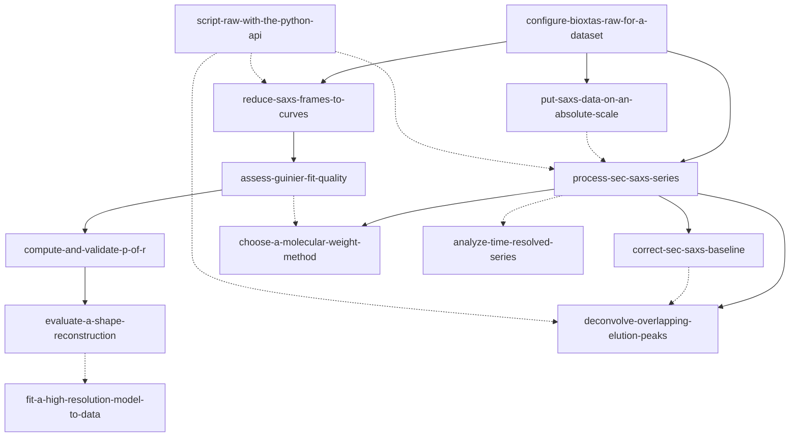

# INDEX — BioXTAS RAW 官方文档（v2.4.2 全站）→ AgentSkill-UsingBioXTASRAW

- **源**: BioXTAS RAW **v2.4.2** 官方文档全站（Sphinx 源码随仓库发布，与 readthedocs 同源）
  `~/Repositories/bioxtasraw/docs/source/` · 97 文件 / 16,010 行（剔除 2,636 行 changelog）
- **一句话主旨**: 官方文档真正教的不是"点哪个按钮"，而是**每一步的判据**——什么样的结果才算数、什么样的结果其实是伪影；RAW 只是承载这些判据的界面与 API。
- **证据分级（本卷的硬规矩）**: **A 级 = manual 全 19 节**（自承"落后好几个版本"，只作对照不作依据）· **B 级 = tutorial / api / saxs / index**（当前权威）· **C 级 = install 里偏旧的版本注记**。文档自身 11 条矛盾与 8 处 manual↔tutorial 冲突见 [`source/README.md`](source/README.md)。
- **流水线**: cangjie-skill（book2skill）RIA-TV++
- **产出**: **13 个 skill**（8 新建 + 5 扩写）；147 条候选 → 19 组单元 → 三重验证通过 13 / 淘汰降级 6 组（通过率 68%）
- **审计轨迹**: [`BOOK_OVERVIEW.md`](BOOK_OVERVIEW.md) · [`verified.md`](verified.md) · [`candidates/`](candidates/)（147 条原文候选）· [`rejected/README.md`](rejected/README.md)

---

## 本卷新增的 8 个 skill

| skill | 覆盖的决策点 | 关键触发 |
|---|---|---|
| [put-saxs-data-on-an-absolute-scale](../../skills/put-saxs-data-on-an-absolute-scale/SKILL.md) | 强度怎么钉到绝对刻度（cm⁻¹）：水 / 玻碳 Simple / 玻碳 Full NIST 三法分叉 + 两条顺序约束 | 「怎么放到绝对刻度」「定标用水还是玻碳」「常数算出来 400 多」 |
| [compute-and-validate-p-of-r](../../skills/compute-and-validate-p-of-r/SKILL.md) | 从 I(q) 到 P(r)：GNOM/DIFT/BIFT 三法按下游选、Dmax 八步定法、五条判据、截断规则 | 「P(r) 末端陡降/振荡」「Dmax 该取多少」「该用 GNOM 还是 BIFT」 |
| [choose-a-molecular-weight-method](../../skills/choose-a-molecular-weight-method/SKILL.md) | 六种 MW 方法选哪一个、能不能信（浓度依赖 vs 无关；SEC 只能用后者） | 「MW 用哪个方法算」「SEC 的 MW 怎么报」「Shape&Size 和 Bayesian 区别」 |
| [evaluate-a-shape-reconstruction](../../skills/evaluate-a-shape-reconstruction/SKILL.md) | 重建做完怎么判能不能用：a-score / NSD / 剔除数 / 聚类 / χ² / Rg·Dmax / 体积 MW 七条判据（含 DENSS 的 FSC） | 「DAMMIF 跑完一堆数字看不懂」「这个形状能不能写进文章」「NSD 0.8 算好吗」 |
| [fit-a-high-resolution-model-to-data](../../skills/fit-a-high-resolution-model-to-data/SKILL.md) | 高分辨模型怎么对照 SAXS：计算即拟合（CRYSOL / PDB2SAS），harmonics 与 N samples | 「理论曲线和实验曲线低 q 差很多」「PDB2SAS 还是 CRYSOL」「AlphaFold 模型能不能验」 |
| [deconvolve-overlapping-elution-peaks](../../skills/deconvolve-overlapping-elution-peaks/SKILL.md) | 峰重叠时按复杂度选 SVD / EFA / REGALS，分量数与区间与 λ 三阶调参 + 复核 | 「SEC 主峰有肩」「IEC 盐梯度怎么分解」「REGALS 的 lambda 怎么调」 |
| [analyze-time-resolved-series](../../skills/analyze-time-resolved-series/SKILL.md) | 一批 series 一起精修：时间校准 → q 裁剪/rebin → 排除帧 → 帧合并 | 「时间分辨 SAXS 怎么做」「millisecond 混合」「Rg 随时间的变化」 |
| [script-raw-with-the-python-api](../../skills/script-raw-with-the-python-api/SKILL.md) | 用 RAWAPI 批量/可复现地做同一件事（load → analyse → save 三段骨架 + 函数清单） | 「30 条曲线批量跑 Guinier」「不想点 GUI」「做成 pipeline」 |

## 本卷扩写的 5 个 skill

| skill | 补了什么 |
|---|---|
| [configure-bioxtas-raw-for-a-dataset](../../skills/configure-bioxtas-raw-for-a-dataset/SKILL.md) | 「配置怎么造出来」六步链 + 掩膜 `Set` 与 `Save to File` 的静默失效 + 指向绝对刻度 skill |
| [reduce-saxs-frames-to-curves](../../skills/reduce-saxs-frames-to-curves/SKILL.md) | WAXS 双探测器合并（scale 0.000014、PIL3 混载陷阱）+ 相似性三视图（残差/比率/CorMap、Average Only Similar Files） |
| [assess-guinier-fit-quality](../../skills/assess-guinier-fit-quality/SKILL.md) | `q_min·Rg<0.65` 下界、按形状分档上界（棒 1.0/球 1.3/盘 1.7）、smile/frown 归因、排除 >3–5 点报警、补救清单、Kratky 交叉验证 |
| [process-sec-saxs-series](../../skills/process-sec-saxs-series/SKILL.md) | 第二 buffer 区处理、`.sec` vs `.hdf5`、Series CSV 列语义 |
| [correct-sec-saxs-baseline](../../skills/correct-sec-saxs-baseline/SKILL.md) | 积分法只允许正向校正 ⇒ 需负校正的 q 会整体过校；先截断到低 q 再校正；线性警告"通常可忽略"的判据 |

---

## 引用图（13 个 skill 的关系，37 条）

（实线 = depends-on；虚线 = composes-with / contrasts-with。完整 37 条关系的逐条语义在各 SKILL.md 的 `related_skills` 段。）

## 推荐顺序（一条完整的判据流水线）

1. **配置**：`configure-bioxtas-raw-for-a-dataset` —— 任何图像处理之前；配置错是静默的。
2. **还原**：`reduce-saxs-frames-to-curves`（批次）或 `process-sec-saxs-series`（连续洗脱）→ 一条净曲线。
3. **判 Rg**：`assess-guinier-fit-quality` —— 单分散吗？Rg 稳定吗？（Kratky 交叉验证柔性）
4. **定刻度/浓度口径**：`put-saxs-data-on-an-absolute-scale`（要绝对强度时）→ `choose-a-molecular-weight-method`（要 MW 时）。
5. **到 P(r)**：`compute-and-validate-p-of-r` —— 三法分工 + Dmax + 判据。
6. **往下走二选一**：
   - 形状 → `evaluate-a-shape-reconstruction`（珠模型/DENSS + 七条判据）；
   - 对照高分辨模型 → `fit-a-high-resolution-model-to-data`（计算即拟合）。
7. **峰重叠时**：`deconvolve-overlapping-elution-peaks`（SVD → EFA/REGALS）；扣减后仍漂 → `correct-sec-saxs-baseline`（注意：做 EFA 时最好不做基线校正）。
8. **多数据集/时间分辨**：`analyze-time-resolved-series`。
9. **要批量/可复现**：`script-raw-with-the-python-api` 把上面任一条变成脚本。

## 本卷明确不覆盖

- **安装与平台**（`10-install` 全 16 节）：强绑平台与包管理器、一次性动作，且带 manual↔tutorial 的版本矛盾 → 只保留"配置来源与校准状态"这类判据。
- **纯界面罗列**（Files tab / Manipulation Panel / Menus / Line properties…）：随 UI 改版即失效。
- **changelog / 引文库 / 视频清单**：与"怎么做"无关；`cite_raw` 的"用哪个方法引哪篇"作为事实存档留在 `candidates/`。
- **实验设计层**（缓冲液怎么配、柱子怎么选、上样量）：属湿实验，不在文档覆盖范围。
- **SAXS 理论本身**（不用 RAW 也能算的部分）：`30-saxs` 的判据已收进各 skill 的 R 段与 B 段，但不做独立理论 skill。
