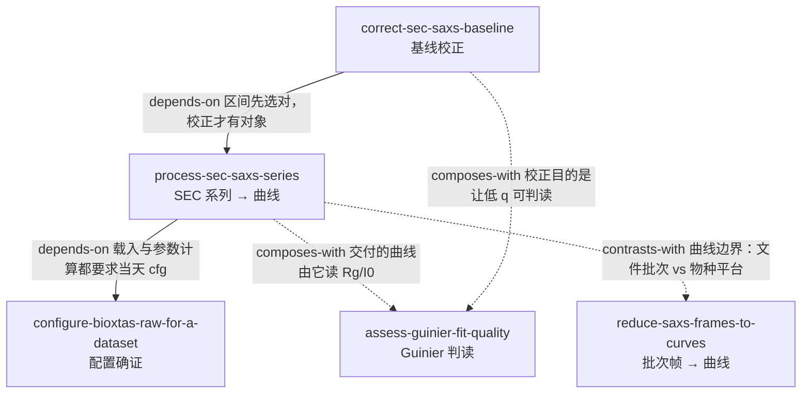

# INDEX — SEC-SAXS 系列 → AgentSkill-UsingBioXTASRAW（升级包）

- **源 A（微信文章）**: 《利用BioXTAS RAW程序处理SEC-SAXS数据》· 刘广峰（公众号「生物小角」）· 2024-04-28 · 正文 2.7k 字 + 12 图
  https://mp.weixin.qq.com/s/mxY3f3mkG5EASyno9GpOTA
- **源 B/C（官方教程）**: BioXTAS RAW *Basic SEC-SAXS processing* / *Advanced Series processing – Baseline correction*（v2.4.1）
- **一句话主旨**: SEC-SAXS 不是"把一批帧平均成一条曲线"，而是**先读洗脱过程 → 用 Rg/MW 的平台区判定哪一段是单一物种 → 只把那一段变成曲线**；缓冲液区怎么定决定这条曲线可不可信。
- **双源关系**: 源 A 是源 B 的翻译 + BL19U2 增补；源 A 砍掉了基线校正整节与"浓度未知"限制，故本包必须同时收官方教程。
- **流水线**: cangjie-skill（book2skill）RIA-TV++
- **产出**: 2 个 skill（43 条候选 → 5 个合并单元 → 三重验证通过 2 / 淘汰 3 组）

---

## skill 总览

| skill | 用途 | 关键触发 |
|---|---|---|
| [process-sec-saxs-series](../skills/process-sec-saxs-series/SKILL.md) | SEC 系列 → 一条可信曲线：色谱图 → buffer/sample 帧区间 → 逐帧扣减 → 平台判据 → 送 Profiles | 「一千多帧怎么变成一条曲线」「Auto 选的 buffer 区能信吗」「Rg 曲线不平」「峰前小峰要不要算进去」「SEC 的 MW 怎么算」 |
| [correct-sec-saxs-baseline](../skills/correct-sec-saxs-baseline/SKILL.md) | 扣减后基线仍漂移：按性质选 Linear / Integral，诊断过校正，与 EFA 互斥 | 「扣完缓冲液基线还在抬」「linear 还是 integral」「积分校正后低 q 翘了」「要做 EFA 能不能先校正」 |

**共享 reference**：[`process-sec-saxs-series/references/sec-saxs-series-workspace.md`](../skills/process-sec-saxs-series/references/sec-saxs-series-workspace.md)
（Series / LC Analysis 面板、三档图、calc markers、CHROMIXS 口径差异、`.hdf5`/CSV/report、12 条术语、BL19U2 差异、未覆盖清单）。

跨包共享：[`bioxtas-raw-glossary.md`](../skills/configure-bioxtas-raw-for-a-dataset/references/bioxtas-raw-glossary.md)（Rg/q 单位、n_min、掩膜、cfg）、
[`raw-workspace-and-naming.md`](../skills/reduce-saxs-frames-to-curves/references/raw-workspace-and-naming.md)（Profiles 列表状态机）。

---

## 引用图（含与第 1 本 skill 的连接）

关系共 5 条（2 条 depends-on、2 条 composes-with、1 条 contrasts-with）。**没有硬造关系**：
`SEC ↔ RED` 是最容易混淆的一对（同为"造一条曲线"），单独用 `contrasts-with` 标出来，
并在两条 skill 的 A2 段互相点名。

## 推荐顺序

1. `configure-bioxtas-raw-for-a-dataset`（第 1 本）——SEC 载入报错、q 轴不可信，都先回到这一步。
2. `process-sec-saxs-series` ——主流程；产出"带平台证据的一条曲线"。
3. `correct-sec-saxs-baseline` ——只在扣减后仍有系统性漂移时插入。
4. `assess-guinier-fit-quality`（第 1 本）——最后读 Rg/I0；SEC 上 I0 不能做绝对标度。

`reduce-saxs-frames-to-curves`（第 1 本）不在 SEC 路线上：它是**批次**数据的等价步骤，
与 SEC 是"曲线的边界由什么决定"这一层的对照。

## 本包明确不覆盖

- **SVD / EFA / REGALS 分解**、**多序列/时间分辨分析**、**WAXS 合并**：官方有独立章节，本次未抓取 → `rejected/README.md` 记录重启条件。
- 唯一保留的相邻边界：做过**积分基线校正**后不要再叠加 EFA 分解（已写进 `correct-sec-saxs-baseline` 的 B 段）。
- SEC 的**实验设计**（柱子、上样量、缓冲液匹配）不在覆盖范围。
